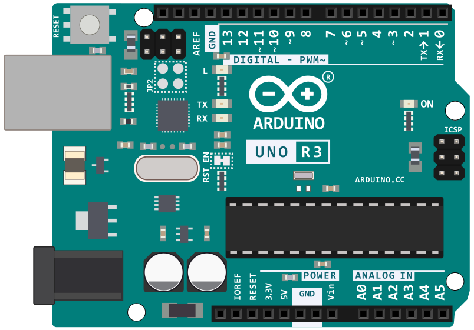

# ATmega328P Assembly Labs

This series of labs is designed to take you from a high-level understanding of the Arduino Uno to a deep, "bare-metal" mastery of the ATmega328P microcontroller using pure AVR Assembly.

## The Hardware: ATmega328P
The ATmega328P is a high-performance, low-power 8-bit RISC microcontroller. Key features explored in these labs include:
* **Advanced RISC Architecture**: 131 powerful instructions, most executed in a single clock cycle.
* **Memory**: 32KB of In-System Self-Programmable Flash and 2KB of Internal SRAM.
* **Peripherals**: Two 8-bit Timer/Counters and one 16-bit Timer/Counter with PWM and Interrupt capabilities.
* **I/O**: 23 programmable I/O lines organized into three ports (B, C, and D).

---

## Lab Progression

Each lab is designed to build on the previous one, increasing in complexity as we unlock more hardware features.

| Lab # | Title | Focus | Key Concepts |
| :--- | :--- | :--- | :--- |
| **01** | **[Blink](./01-blink)** | **The Basics** | Stack initialization, Data Direction Registers (DDR), and software delay loops. |
| **02** | **[Timed Blink](./02-timedblink)** | **Hardware Timers** | 16-bit Timer1, CTC Mode, Prescalers, and Interrupt Service Routines (ISR). |
more follows
---

## Hardware Setup (Pin 13 LED)

For all labs involving visual output, we use the built-in LED on Pin 13 (Port B, Bit 5). To connect an external LED:
1. **LED Anode (Long Leg)**: Connect to Digital Pin 13.
2. **Resistor (220Ω)**: Connect between LED Cathode (Short Leg) and GND.
3. **Resistor Color Code**: Red-Red-Brown.

  

  

---

## Technical Stack

These labs utilize a specialized toolchain to ensure a smooth transition between simulation and reality:
* **Simulation**: `simavr` provides cycle-accurate emulation of the ATmega328P core.
* **Visualization**: Custom C-based LED visualizers simulate hardware response via Unix Sockets.
* **Deployment**: The `flash` tool handles port discovery and communication with the Arduino bootloader.
* **Analysis**: `avr-objdump` is used to verify that the compiled machine code matches our assembly intent.
